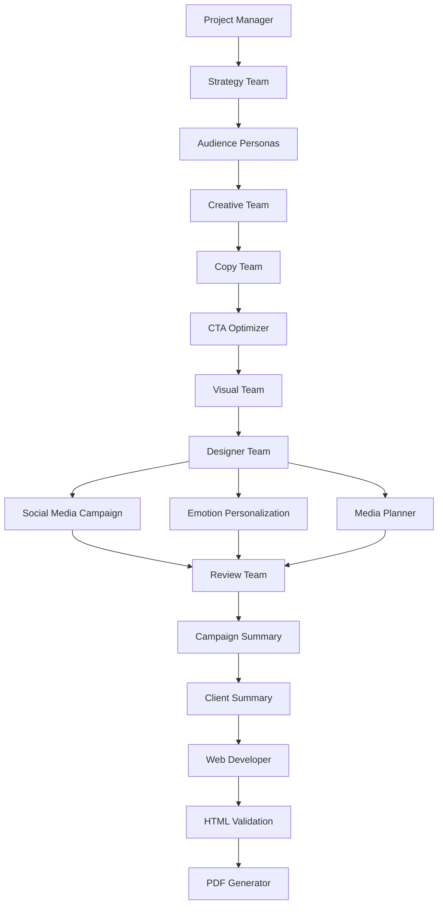

# 🎨 Multi-Agent Marketing Campaign Generation System

A sophisticated multi-agent system for generating comprehensive marketing campaigns with integrated image generation, social media strategies, and hyperpersonalized content using LangChain and LangGraph.

## 🏗️ Project Structure

```
multi_agents/
├── src/
│   ├── agents/              # Specialized AI agent classes
│   │   ├── __init__.py
│   │   ├── base_agent.py    # Base agent class with error handling
│   │   ├── content_agents.py # Content generation agents
│   │   ├── design_agents.py  # Design and validation agents
│   │   ├── analysis_agents.py # Analysis and optimization agents
│   │   ├── output_agents.py  # Output generation agents
│   │   └── specialized_agents.py # Social media and personalization agents
│   ├── utils/               # Utility functions and shared components
│   │   ├── __init__.py
│   │   ├── state.py         # Workflow state management
│   │   ├── config.py        # Configuration and API setup
│   │   ├── monitoring.py    # Workflow monitoring and quality checking
│   │   └── file_handlers.py # File I/O and output generation
│   └── workflows/           # Workflow definitions
│       ├── __init__.py
│       └── campaign_workflow.py # Main campaign generation workflow
├── outputs/                 # Generated campaign content
│   ├── pdfs/               # PDF reports
│   └── *.html              # Generated campaign websites
├── docs/                    # Documentation
├── tests/                   # Unit and integration tests
├── main.py                  # Main entry point
├── display_graph.py         # Workflow visualization tool
├── requirements.txt         # Python dependencies
├── .env.example            # Environment variables template
├── .gitignore              # Git ignore rules
└── README.md               # This file
```

## 🚀 Quick Start

### 1. Setup Environment
```bash
# Clone the repository
git clone <repository-url>
cd multi_agents

# Create virtual environment
python -m venv venv
source venv/bin/activate  # On Windows: venv\Scripts\activate

# Install dependencies
pip install -r requirements.txt
```

### 2. Configure API Keys
```bash
# Copy environment template
cp .env.example .env

# Edit .env with your API keys
# Required:
OPENROUTER_API_KEY=your_openrouter_key_here
OPENROUTER_BASE_URL=https://openrouter.ai/api/v1

# Optional (for DALL-E image generation):
OPENAI_API_KEY=your_openai_key_here
```

### 3. Run Campaign Generation
```bash
# Generate a complete marketing campaign
python main.py

# Visualize the workflow (optional)
python display_graph.py
```

## 🤖 System Features

### 🎯 **15 Specialized AI Agents**
- **Project Manager**: Workflow coordination and revision management
- **Strategy Team**: Campaign analysis and strategic recommendations
- **Creative Team**: Innovative concept generation
- **Copy Team**: Compelling ad copy creation
- **Visual Team**: Image prompt generation for DALL-E
- **Designer Team**: AI image generation and visual assets
- **CTA Optimizer**: Call-to-action optimization
- **Audience Persona Agent**: Detailed audience profiling
- **Media Planner**: Multi-platform distribution strategy
- **Social Media Campaign Agent**: TikTok/Instagram campaign strategies
- **Emotion Personalization Agent**: Hyperpersonalized messaging for 13 emotion types
- **Review Team**: Quality assessment and feedback
- **Campaign Summary Agent**: Comprehensive campaign summarization
- **Client Summary Generator**: Executive-level business summaries
- **Web Developer**: Modern campaign website generation
- **HTML Validation Agent**: Code quality and accessibility validation
- **PDF Generator Team**: Professional report creation

### 🛡️ **Enterprise-Grade Reliability**
- **Circuit Breaker Pattern**: Prevents API cascade failures
- **Retry Logic**: Exponential backoff for failed requests
- **Fallback Responses**: Graceful degradation when APIs fail
- **Quality Gates**: Automatic quality assessment and thresholds
- **Timeout Management**: Workflow completion guarantees
- **Change Detection**: Intelligent revision control

### 📊 **Professional Outputs**
- **Interactive Campaign Websites**: Modern, responsive HTML/CSS/JS
- **Executive PDF Reports**: Comprehensive business documentation
- **Social Media Strategies**: Platform-specific TikTok/Instagram campaigns
- **Hyperpersonalized Content**: Emotion-based messaging (13 emotion types)
- **Visual Assets**: AI-generated images with DALL-E integration
- **Analytics Dashboard**: Performance metrics and recommendations

## 🔧 Configuration Options

### Environment Variables
```bash
# Required - OpenRouter API for LLM access
OPENROUTER_API_KEY=sk-or-v1-xxxxx
OPENROUTER_BASE_URL=https://openrouter.ai/api/v1

# Optional - OpenAI for DALL-E image generation
OPENAI_API_KEY=sk-xxxxx

# Optional - Model selection
RATIONAL_MODEL=google/gemini-2.5-flash-lite

# Optional - LangSmith tracing
LANGSMITH_TRACING=true
LANGSMITH_API_KEY=lsv2_pt_xxxxx
LANGSMITH_PROJECT=campaign-generation
```

### Campaign Brief Customization
Edit the campaign brief in `main.py`:
```python
campaign_brief = {
    "product": "Your Product/Service",
    "client": "Client Name",
    "client_website": "https://example.com",
    "target_audience": "Your target audience",
    "goals": ["Goal 1", "Goal 2", "Goal 3"],
    "budget": "$X,XXX",
    "timeline": "X months"
}
```

## 📈 Workflow Overview



## 🎨 Output Examples

### Generated Campaign Website
- **Modern responsive design** with CSS Grid/Flexbox
- **Interactive elements** and smooth animations
- **SEO-optimized** structure and meta tags
- **Accessibility compliant** with ARIA attributes
- **Mobile-first** responsive design
- **Performance optimized** code

### Professional PDF Reports
- **Executive summary** and business impact analysis
- **Comprehensive strategy** breakdown
- **Visual asset integration** with embedded images
- **Performance metrics** and recommendations
- **Client-ready formatting** with professional layout

### Social Media Campaigns
- **Platform-specific strategies** for TikTok and Instagram
- **Trending hashtags** and keyword optimization
- **Content calendar** and posting schedules
- **Influencer collaboration** opportunities
- **User-generated content** strategies

### Hyperpersonalized Messaging
Content variations for **13 emotion types**:
- HAPPY, EXCITED, CALM, ANXIOUS
- CONFIDENT, CURIOUS, SAD, ANGRY
- SCARED, DISGUSTED, SURPRISED, LOVED, JEALOUS

## 🧪 Development & Testing

### Run Tests
```bash
# Run unit tests
python -m pytest tests/

# Run with coverage
python -m pytest tests/ --cov=src/
```

### Code Quality
```bash
# Format code
black src/ tests/

# Lint code
flake8 src/ tests/

# Type checking
mypy src/
```

## 🔐 Security & Best Practices

- ✅ **Environment Variables**: All API keys stored securely in `.env`
- ✅ **Error Handling**: Comprehensive exception handling and logging
- ✅ **Rate Limiting**: Built-in API rate limit management
- ✅ **Input Validation**: Sanitized inputs and output validation
- ✅ **Fallback Systems**: Graceful degradation on service failures
- ✅ **Monitoring**: Real-time workflow monitoring and alerts

## 🤝 Contributing

1. Fork the repository
2. Create a feature branch (`git checkout -b feature/amazing-feature`)
3. Commit your changes (`git commit -m 'Add amazing feature'`)
4. Push to the branch (`git push origin feature/amazing-feature`)
5. Open a Pull Request

## 📝 License

MIT License - see [LICENSE](LICENSE) file for details.

## 🆘 Troubleshooting

### Common Issues

**JSONDecodeError**: Check API keys and network connectivity
```bash
# Verify API keys are set
echo $OPENROUTER_API_KEY
```

**Circuit Breaker Activated**: API service temporarily unavailable
- Wait for automatic recovery
- Check OpenRouter service status
- Verify API quota limits

**Module Import Errors**: Ensure you're in the correct directory
```bash
# Run from project root
python main.py
```

### Getting Help

- 📚 Check the [documentation](docs/)
- 🐛 Report issues on GitHub
- 💬 Join our community discussions

---

Built with ❤️ using LangChain, LangGraph, and OpenAI APIs